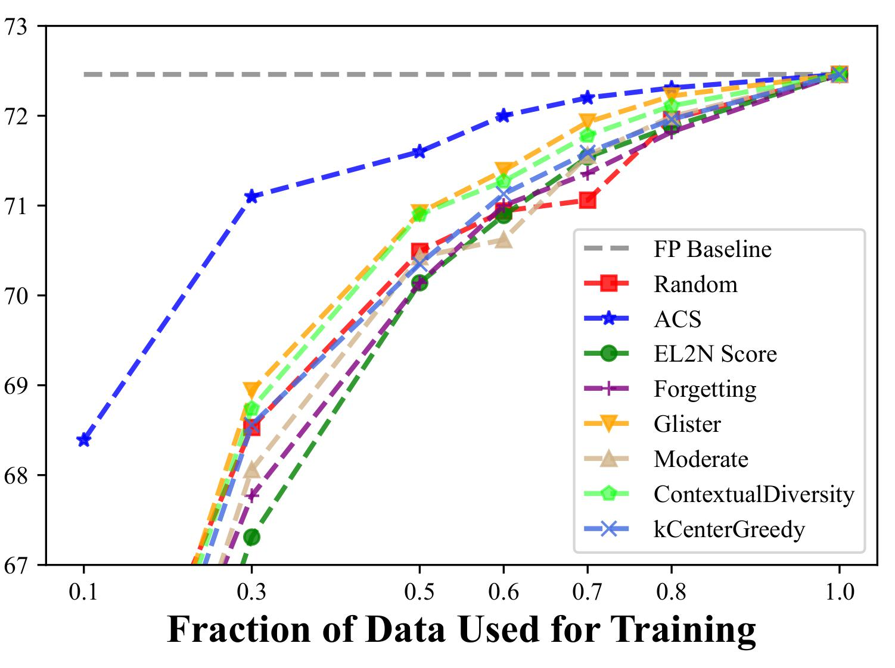
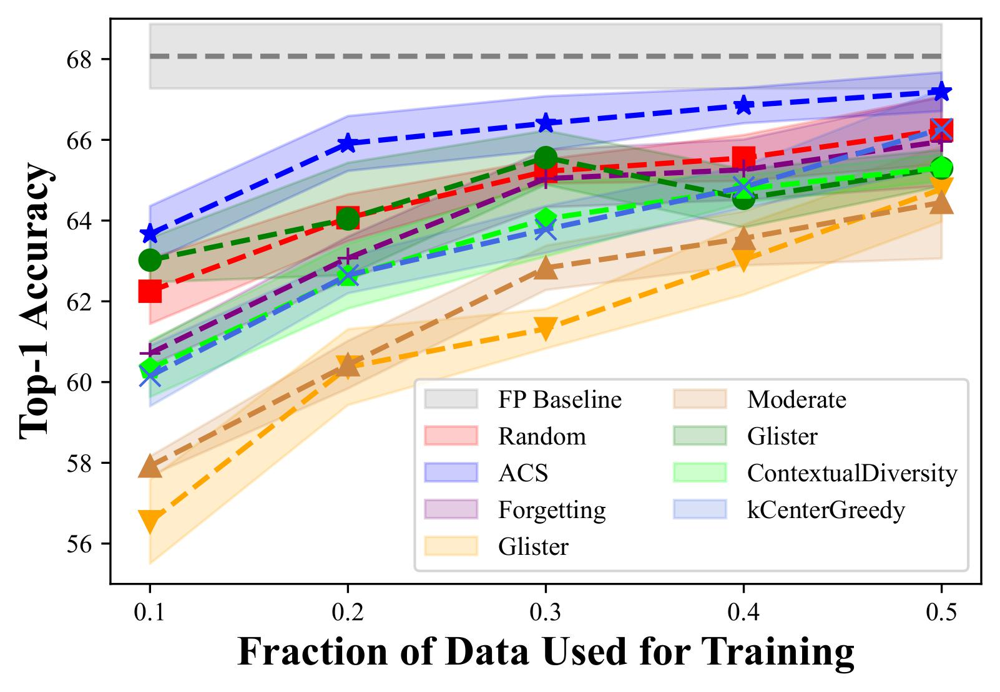

# QAT-ACS: Efficient Quantization-aware Training with Adaptive Coreset Selection (TMLR) [[Paper]](https://arxiv.org/abs/2306.07215) [[OpenReview]](https://openreview.net/forum?id=4c2pZzG94y)

This is the pytorch implementation of Transactions on Machine Learning Research (TMLR) paper "Efficient Quantization-aware Training with Adaptive Coreset Selection" [[Paper]](https://arxiv.org/abs/2306.07215)

## Introduction
In this work, we propose a new angle through the coreset selection to improve the training efficiency of quantization-aware training. Our method can achieve an accuracy of 68.39% of 4-bit quantized ResNet-18 on the ImageNet-1K dataset with only a 10% subset, which has an absolute gain of 4.24% compared to the previous SoTA.


## Datasets and Models
For dataset, we have evaluate our method on ImageNet-1K and CIFAR-100. There are other popular computer vision datasets including MNIST, QMNIST, FashionMNIST, SVHN, CIFAR10, and TinyImageNet. For models, we have evaluate our method on ResNet-18 and MobileNet-V2. There are other network architectures implementation such as MLP, LeNet, AlexNet, VGG, Inception-v3, WideResNet and MobileNet-V3, and quantization-aware training has not been implemented on these models currently.

## Results

### ResNet-18 on ImageNet-1K (4-bit W/A Quantization)


<div align=center>

</div>

### MobileNet-V2 on CIFAR-100 (2-bit W Quantization)


<div align=center>

</div>

## Run

### Requirements
```
pip install -r requirements.txt
```
### Dataset
Download [ImageNet LSVRC 2012 dataset](https://www.image-net.org/) following the [official PyTorch ImageNet training code](https://github.com/pytorch/examples/tree/main/imagenet)
### Pretrained Model
For ResNet-18 experiments, [PyTorch Official Pretrained ResNet-18](https://pytorch.org/vision/stable/models/generated/torchvision.models.resnet18.html#torchvision.models.resnet18) will be automatically loaded. For MobileNet-V2, please use `--resume ./pretrained_model/CIFAR100_Mobilenetv2_72.56.ckpt`.

### Getting Started
QAT of 4-bit ResNet-18 with our ACS and training on the ImageNet-1K coreset with fraction 0.1.
```
CUDA_VISIBLE_DEVICES=0,1 python main.py --fraction 0.1 --dataset ImageNet --data_path /datasets-to-imagenet --num_exp 1 --workers 8 --optimizer Adam -se 5 --selection ACS --adaptive cosine --model QResNet18 --bitwidth 4 --lr 1.25e-3 --batch 512 --teacher resnet101 --epochs 120 --data_update_epochs 10 --log ./logs/logs_4bit_10_cosine_acs_update10.txt
```

QAT of 2-bit MobileNetV2 with our ACS and training on the CIFAR-100 coreset with fraction 0.1 (repeat 5 times).
```
CUDA_VISIBLE_DEVICES=0 python main.py --fraction 0.1 --dataset CIFAR100 --model QMobilenetv2 --selection ACS --num_exp 5 --epochs 200 --min_lr 0  --lr 0.01 --weight_decay 5e-4 --batch-size 256 --scheduler LambdaLR --adaptive cosine --resume ./pretrained_model/CIFAR100_Mobilenetv2_72.56.ckpt --bitwidth 2 --log ./logs/lsq_2bit_mobilenetv2_cifar100_ACS10new.log
```

### Additional Dataset and Model

Our code is mainly based on [DeepCore](https://github.com/PatrickZH/DeepCore), which is highly modular and scalable. It allows to add new architectures, datasets and selection methods easily, to help coreset methods to be evaluated in a richer set of scenarios, and also to facilitate new methods for comparison. Here is an example for datasets. To add a new dataset, you need implement a function whose input is the data path and outputs are number of channels, size of image, number of classes, names of classes, mean, std and training and testing dataset inherited from ```torch.utils.data.Dataset```.


```python
from torchvision import datasets, transforms


def MNIST(data_path):
    channel = 1
    im_size = (28, 28)
    num_classes = 10
    mean = [0.1307]
    std = [0.3081]
    transform = transforms.Compose([transforms.ToTensor(), transforms.Normalize(mean=mean, std=std)])
    dst_train = datasets.MNIST(data_path, train=True, download=True, transform=transform)
    dst_test = datasets.MNIST(data_path, train=False, download=True, transform=transform)
    class_names = [str(c) for c in range(num_classes)]
    return channel, im_size, num_classes, class_names, mean, std, dst_train, dst_test
```
This is an example for implementing network architecture.
```python
import torch.nn as nn
import torch.nn.functional as F
from torch import set_grad_enabled
from .nets_utils import EmbeddingRecorder


class MLP(nn.Module):
    def __init__(self, channel, num_classes, im_size, record_embedding: bool = False, no_grad: bool = False,
                 pretrained: bool = False):
        if pretrained:
            raise NotImplementedError("torchvison pretrained models not available.")
        super(MLP, self).__init__()
        self.fc_1 = nn.Linear(im_size[0] * im_size[1] * channel, 128)
        self.fc_2 = nn.Linear(128, 128)
        self.fc_3 = nn.Linear(128, num_classes)

        self.embedding_recorder = EmbeddingRecorder(record_embedding)
        self.no_grad = no_grad

    def get_last_layer(self):
        return self.fc_3

    def forward(self, x):
        with set_grad_enabled(not self.no_grad):
            out = x.view(x.size(0), -1)
            out = F.relu(self.fc_1(out))
            out = F.relu(self.fc_2(out))
            out = self.embedding_recorder(out)
            out = self.fc_3(out)
        return out
```

To implement the new coreset method, you need to inherit the new method from the ```CoresetMethod``` class and return the selected indices via the ```select``` method.

```python
class CoresetMethod(object):
    def __init__(self, dst_train, args, fraction=0.5, random_seed=None, **kwargs):
        if fraction <= 0.0 or fraction > 1.0:
            raise ValueError("Illegal Coreset Size.")
        self.dst_train = dst_train
        self.num_classes = len(dst_train.classes)
        self.fraction = fraction
        self.random_seed = random_seed
        self.index = []
        self.args = args

        self.n_train = len(dst_train)
        self.coreset_size = round(self.n_train * fraction)

    def select(self, **kwargs):
        return
```

## Acknowledgement and Citation
The code is mainly based on [DeepCore](https://github.com/PatrickZH/DeepCore). If you find our code is helpful for your research, please cite:
```
@article{huang2023efficient,
    title={Efficient Quantization-aware Training with Adaptive Coreset Selection}, 
    author={Xijie Huang, Zechun Liu, Shih-yang Liu, Kwang-Ting Cheng},
    year={2023},
    archivePrefix={arXiv},
}
```
If you have any questions, feel free to contact Xijie Huang (xhuangbs@connect.ust.hk)
